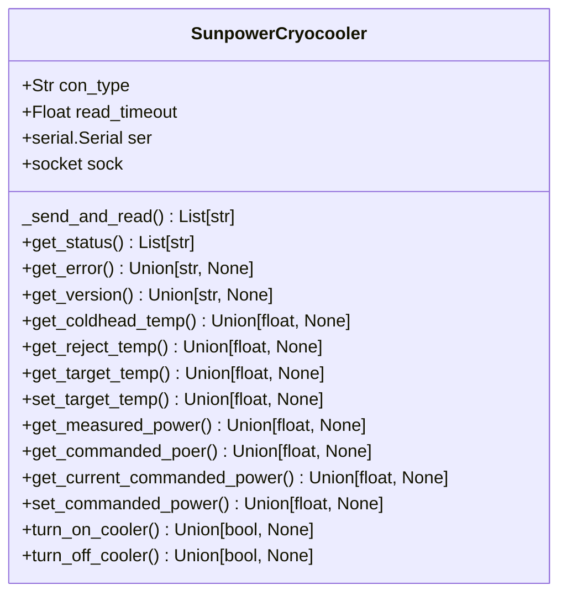

# sunpower

A collection of Python interfaces for communicating with HISPEC FEI components.

## Features

- Query device status, error, and firmware version
- Get and set target temperature
- Get and set user commanded power
- Get reject and cold head temperatures
- Turn cooler on or off
- Supports both serial and TCP (socket) connections with error handling

## Requirements

- Install base class from https://github.com/COO-Utilities/hardware_device_base

## Installation

```bash
pip install .
```

## Usage
### Serial Connection
```python
from sunpower_cryocooler import SunpowerCryocooler

controller = SunpowerCryocooler()
controller.connect('/dev/ttyUSB0', 9600, con_type="serial")

print("\n".join(controller.get_status()))
controller.set_target_temp(300.0)
controller.turn_on_cooler()
print("\n".join(controller.get_commanded_power()))
print("\n".join(controller.get_measured_power()))
controller.set_commanded_power(10.0)
print("\n".join(controller.get_reject_temp()))
print("\n".join(controller.get_cold_head_temp()))
```

### TCP Connection
```python
from sunpower_cryocooler import SunpowerCryocooler

controller = SunpowerCryocooler()
controller.connect("192.168.29.100", 10016, con_type="tcp")

print("\n".join(controller.get_status()))
controller.set_target_temp(300.0)
controller.turn_on_cooler()
print("\n".join(controller.get_commanded_power()))
print("\n".join(controller.get_measured_power()))
controller.set_commanded_power(10.0)
print("\n".join(controller.get_reject_temp()))
print("\n".join(controller.get_cold_head_temp()))
```

## 🧪 Testing
Unit tests are located in `tests/` directory and use `pytest` with `unittest.mock` to simulate hardware behavior — no physical sunpower controller is required.

To run all tests from the project root:

```bash
pytest
```

## Class Diagram

Below is a class diagram of the added methods and attributes for the sunpower.
See the README for the hardware_device_base module for the inherited methods and
attributes.

